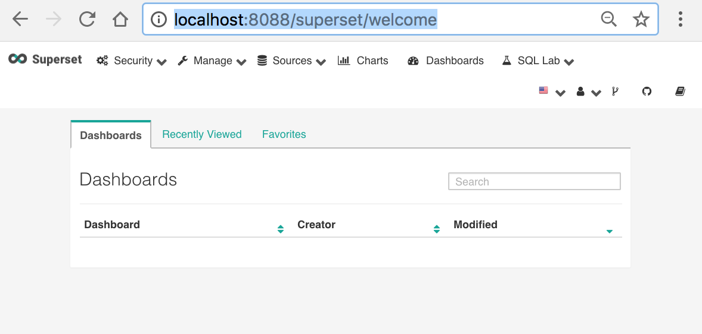
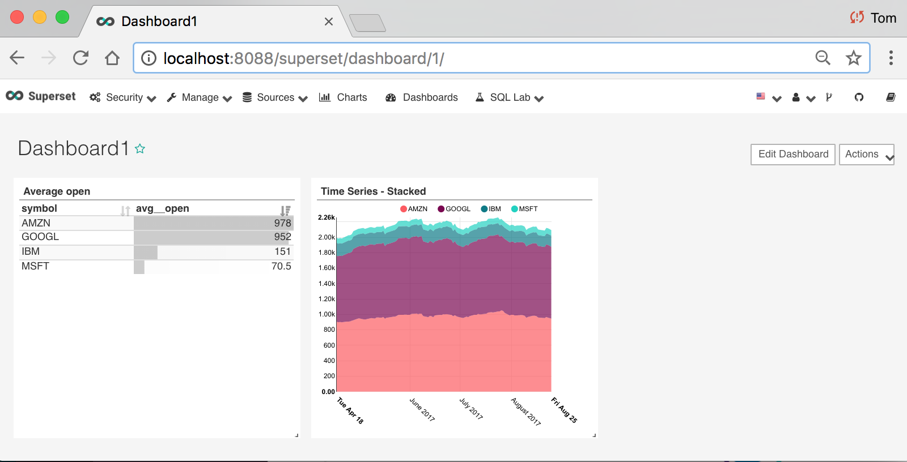
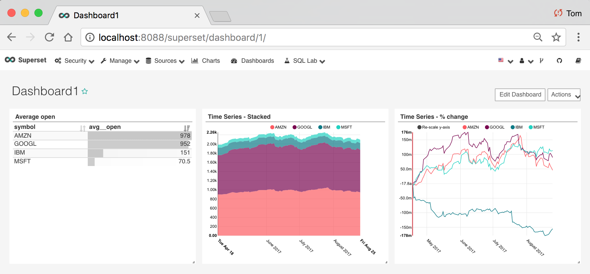

You need to know a few things about docker and then you can learn along the way:

Docker can be used to “containerize” (i.e. encapsulate) software with configuration.

For Java developers, please consider:

Analogy to JDK
--------------

|Docker world|Java world|
-------------|:-----------|
|Dockerfile|Java file|
|engine|JVM|
|image|class  (classes are hierarchical, so are images)|
|container|object or instance|

> We build images - similar to Java classes - which get added to your local registry

> and then run containers - similar to instances of the classes

Docker will search for images in your local registry and then your specified registries 
(by default [dockerhub](https://hub.docker.com/)). The objects can reference 
[storage](https://docs.docker.com/storage) that exists outside the container allowing
the container to remain stateless.

Let's take this example:

``docker run -d --name super_container -p 8088:8088 tylerfowler/superset``

This command will fetch the docker image [tylerfowler/superset](https://hub.docker.com/r/tylerfowler/superset) from dockerhub, unless I have previously downloaded it 
and then it will run a container based on the image. It will map the docker host port to the container port 
(in this case 8088 is mapped to 8088). We can make changes to the resulting container but the problem is that the changes 
will not be persisted and the container is considered stateful.

When you open http://localhost:8088/superset/welcome, you will see:

To overcome this problem, use the following command:

``docker run -d -v `pwd`/superset:/superset -w /superset --name super_container -p 8088:8088 tylerfowler/superset``

This command includes the volume flag ``-v `pwd`/superset:/superset`` which will map the containers `/superset` to the 
host's current working directory's `superset` directory. Changes made in the host or container's mapped directories will be reflected in the other. If I have content in my host's superset directory then the above command may show the following:

Now let's add a chart to our dashboard and then completely remove the container and restart it with the same command. If the container is stateless, we should see the newly added chart.

